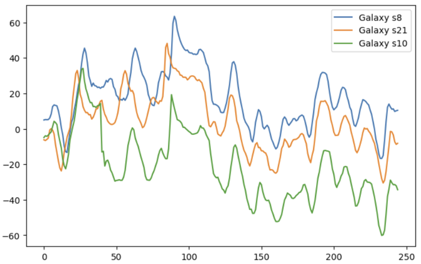

# Geomagnetic-Indoor-Positioning
- 딥러닝을 학습함과 동시에 논문의 문장과 수식을 코드로 번역할 수 있는 역량을 기르기 위해 논문 구현을 시도한다.
- 나만의 신경망 모델을 구축하여 실생활 적용에 대한 경험적 지식을 축적한다.
- 이 프로젝트는 안드로이드 구현에 대해선 다루지 않는다.

# **1. 논문 읽기**
>강민규, 임영준, 허수정, 박용완. (2019). 지구자기장 세기 패턴 기반의 실내 측위 기법. 한국통신학회논문지, 44(8), 1510-1519.

>배한준, 최린. (2021). 실제 이동에 따른 자기장 랜덤성을 반영한  LSTM 기반 실내 위치 인식 시스템. 한국차세대컴퓨팅학회 논문지, 17(3), 30-38.

# **2. 필요 역량**
- Android: Java 기본 문법 및 센서 제어
- Python: 데이터 분석/전처리
- Pytorch: 신경망 모델링

# **3. 논문 구현**
<details>
<summary style="margin: 10px; font-weight:bold; color:#666; font-size:16px">자세히 보기</summary>
<div markdown="1">

## **3.1 주제 소개**
### **3.1.1 GPS**
최근 건물의 크기는 커져가고 구조물 또한 복잡해지고 있기 때문에 현재 위치를 측정할 수 있는 기술의 필요성이 커져가고 있다. 현재 우리는 GPS를 이용한 실외 길 안내 서비스를 유용하게 사용해오고 있지만 대부분의 사람들은 실내에서 시간을 보내기 때문에 실내 위치 서비스를 제공하는 기술에 대한 강한 수요가 남아 있다.
### **3.1.2 IPS**
GPS는 실외 공간에서만 동작한다는 한계가 있다. 실내의 사용자에게까지 그 신호가 미약하기 때문에 높은 정확도를 바랄 수 없다. 실내 위치 추적이라 불리는 IPS는 GPS 신호가 충분히 강하지 않은 밀폐된 공간 내에서 사람이나 물체를 찾는 데 사용되는 장치 네트워크이다. GPS가 지구 어디에서나 물체를 찾는 데 도움이 되는 것처럼, IPS는 동일하지만 기차역과 같은 넓은 실내 공간에서 쇼핑몰, 병원 및 지하 위치에서 물체의 위치를 정확하게 찾아낼 수 있다.
### **3.1.3 비전파 자원: 지구자기장**
실내 측위를 위한 여러가지 방법들이 제안되고 있다. 대표적인 측위 자원으로 전파와 비전파로 나눌 수 있는데, 전파 자원은 WIFI, 비콘, 블루투스 등과 같은 장치를 사용한 방법이 대표적이다. 하지만 이런 기술들은 전력소모와 설치비용의 문제가 있으며, 전파간섭으로 인해 정확한 실내 측위에 어려움이 있다. 또한, 시간 축 방향으로 측정되는 값이 일정하지 않기 때문에 측위 성능이 낮아질 수 있다.

반면, 스마트폰에 내장되어 있는 센서를 이용한 실내 측위 방법이 있다. 그 중 자력계 센서는 비전파 자원인 지구자기장을 이용하기 대문에 전파 자원의 고질적인 전파 간섭의 문제를 해결할 수 있으며, 무엇보다도 지구 고유의 자원을 사용하기 때문에 인프라 구축의 문제에서도 자유로울 수 있다. 뿐만 아니라 지구자기장은 일반적인 전파자원과 달리 시간 축 방향으로 거의 일정하게 유지되기 때문에 특정 위치에 대한 값의 고유성을 보다 쉽게 갖출 수 있다.
### **3.1.4 지구자기장 세기**
스마트폰에 내장된 지자기 센서는 방위 정보를 얻을 수 있다. 지자기 센서에는 X, Y, Z의 3축 타입이 있으며, 그 방향의 자력치를 계측한다. 수집한 3개의 데이터로 아래와 같이 지구자기장 전체 세기를 구할 수 있다.
$$\rm{Mag_F} = \sqrt{{Mag_X}^2+{Mag_Y}^2+{Mag_Z}^2}$$
<p align="center" style="color:gray">
    <br/>
    <지자기센서 값>
</p>

### **3.1.5 지구자기장 왜곡현상**
실내에서의 지구자기장은 실외와 달리 세기 분포도가 다양하다. 그 이유는 건물 주재료인 철근, 콘크리트, H 빔과 설치 구조물, 전자기기 등에 의해 지구자기장 교란 및 변화가 일어나기 때문이다. 
    
왜곡현상은 현재 위치를 측정함에 있어 필수적인 환경 조건이다. 실외와 달리 실내에서는 지점마다 그 세기가 다양하기 때문에 위치적 고유성을 가지기 위한 좋은 데이터로써 활용될 수 있다.
## **3.2 기존 실내 측위 기술**
### **3.2.2 기종마다 다른 지구자기장 세기**
기존의 지구자기장 세기 기반의 실내 측위 방법은 $\rm{Mag_F}$ 값만을 사용하여 지점마다의 고유한 지문으로써 사용되는데, 스마트폰에 내장된 자력계 센서가 민감하고, 기종마다 서로 다른 자력계 센서가 내장되어 있어 동일 지점에서 서로 다른 지구자기장 세기가 수집되는 문제점이 있다.
<p align="center" style="color:gray">
    <br/>
    <기종마다 다른 지구자기장 세기>
</p>

### **3.2.3 미미한 지구자기장 왜곡현상**
또한, 건물에 사용된 건축 재료에 따라 그 왜곡의 정도도 다르기 때문에 장소에 따라 지자기 값의 변화 폭이 좁을 수 있다. 폭이 좁다는 것은 지점마다 표현할 수 있는 좌표의 수가 줄어들기 때문에 이것은 측위 성능을 저하시키는 큰 요인이 될 수 있다. 즉, 기본의 측위 기법은 단일 값으로만 좌표를 추출해내기 때문에 아래 그림과 같이 세기 분포 범위가 좁을수록 비슷한 값을 가진 여러 지점이 존재할 수 있다는 것이다.
<div align="center" style="display:flex; margin-top:10px">
    <p align="center" style="color:gray">
        <br/>
        <왜곡 현상이 적은 곳>
    </p>
    <p align="center" style="color:gray">
        <br/>
        <왜곡 현상이 많은 곳>
    </p>
</div>

<br/>

## **3.3 제안 기법**
자연어 처리에 사용되는 1D 합성곱 신경망을 사용하여 지자기 변화 패턴을 제안 기법의 자원으로 사용하는 것이다. 이 기법은 현재 측정되는 지자기 세기 값 뿐만 아니라 과거 측정된 지자기 세기 값 또한 받아들여 그 관계성을 추가하여 측위 성능을 개선한다.
### **3.3.1 데이터 수집**
<p align="center" style="color:gray">
    <br/>
    <계명아트센터 지하주차장>
</p>

실내 측위의 실험 공간은 계명아트센터 지하주차장을 대상으로 진행했다. 일자형 복도와 코너가 있는 환경으로 구성되어있으며, 평균 총 걸음 수는 245걸음(약 150m)이다. 데이터 수집 조건은 다음과 같다.<br/>
- 3개의 서로 다른 기종(Galaxy s8, s10, s21)
- 스마트폰 높이는 사용자 명치 부군, 기울기는 수평으로 고정
- 일정한 속도로 보행
- 10Hz 샘플링 속도
- 보행거리 5 걸음에 대한 지구자기장 세기 변화 패턴 생성

### **3.3.2 데이터 전처리**
먼저 지정된 경로의 지하주차장을 일정한 속도로 보행하면서 기록된 무작위 길이(N)의 데이터 파일들을 각 데이터 파일마다 245걸음 길이로 맞추도록 정돈한다. 각 데이터 파일은 걸음마다 $\rm{Mag_X,Mag_Y,Mag_Z,Mag_F}$ 총 4개의 값이 저장되어 있다.
```python
for i, path in enumerate(data_list):
    df = pd.read_table(path, sep=" ", dtype='f')
    x[i].append(pd.DataFrame(
        df, 
        columns=['X', 'Y', 'Z', 'F'], 
        index=np.linspace(0, len(df)-1, 
        point_n, 
        endpoint=True, 
        dtype='i')
    ))
```
<p align="center" style="color:gray">
    
</p>

### **데이터 패턴화**
정돈된 입력 데이터는 아래 그림과 같이 5 걸음의 패턴을 1걸음씩 슬라이딩 하여 6450개의 패턴을 생성한다. 또한, 입력 데이터에 대해 도출되기를 원하는 출력 데이터의 크기는 0부터 239 범위의 라벨을 가지며, 총 크기는 240이 된다.
```python
for i in range(sample_size):
    for j in range(point_n - pattern_n):    # 슬라이딩 횟수
        px[i].append(x[i*point_n+j:i*point_n+j+pattern_n])
        py.append(j)
```
<p align="center" style="color:gray">
    
</p>
아래 그림은 0번 라벨로 도출되기를 원하는 0번부터 4번 지점까지의 지자기 세기 변화 패턴과 1번 라벨로 도출되기를 원하는 1번부터 5번 지점까지의 지자기 세기 변화 패턴을, 그 뒤를 이어 2번 라벨로 도출되기를 원하는 2번부터 6번 지점까지의 지자기 세기 변화 패턴을 도식화하여 그린 것이다.
<p align="center" style="color:gray">
    
</p>

### **3.3.3 합성곱 신경망과 LSTM**
1. 데이터 전처리과정을 통해 얻어진 학습 데이터 파일은 합성곱 신경망을 통해 학습된다. 심층 신경망의 한 종류인 합성곱 신경망은 이미지 인식 알고리즘에 있어 좋은 성능을 보여준다.
2. 특히 Conv1D는 시계열 데이터에 대해서 중요한 정보를 추출해낼 수 있다. **특징 융합 계층**에서 자력계 센서 값과 같은 1차원 데이터를 1차원 컨볼루션 신경망을 사용하여 서로 다른 변수를 결합하고 변수 간의 공간적 상관관계를 추출한다. Conv1D는 한 차원에 대한 커널 슬라이딩을 통해 공간적 상관관계를 추출한다. 
3. 이어서 **LSTM 기반 시계열 예측 계층**을 추가하여 다변량 입력 데이터에 대해 학습 적응력 문제를 완화할 수 있도록 하였다. LSTM 모델에 드롭아웃 옵션을 추가하여 과적합 문제를 방지한다. 
4. 마지막으로 다중 분류 문제를 위한 **소프트맥스 함수**를 사용하여 0부터 239지점까지 가장 높은 확률의 한 지점을 선택하여 결과를 도출한다.
<p align="center" style="color:gray">
    
</p>

### **3.3.4 모델 경량화**
학습된 모델을 모바일에 적용시키기 위해서 경량화 작업이 필수적이다.

### **3.3.5 실험 결과**
측위 실험은 데이터 수집 경로와 동일하다. 각 기법에 대해 3개의 기종을 모두 사용하여 데이터를 수집하여 학습한 후 실험해본 결과, 기존 기법을 사용한 것에 비해 제안 기법을 사용할 때, 기기 종류와 상관없이 비슷한 평균 성능을 낼 수 있음을 알 수 있다.
<p align="center" style="color:gray">
    
</p>

</div>
</details>

# **4. 실행방법**
```bash
position-classifier
├── classifier
│   ├── models
│   │   └── cnn1d.py
│   ├── trainer.py
│   └── utils.py
├── data
│   ├── original
│   ├── test
│   ├── train
│   └── preprocessing.ipynb
├── weights
│   ├── for_mobile.pt
│   └── model.pt
├── convert.ipynb
├── predict.ipynb
└── train.py
```
## **4.1 데이터수집** : `preprocessing.ipynb`
자기만의 실내측위 앱을 구축하기 위해선 데이터 수집부터 해야한다. 데이터 수집은 아래의 단계에 따라 진행된다.
1. 실험 경로 지정: 자기장 영향을 많이 받는 장소
2. 실험 경로의 평균 걸음 수 측정
3. 패턴화 간격 지정
3. 안드로이드 자력계 센서를 이용하여 값 추출: [안드로이드 센서 제어 방법](https://developer.android.com/guide/topics/sensors/sensors_overview?hl=ko)
5. 데이터 파일 저장: `./data/original`, `./data/test`
6. 패턴화 작업 : `./data/train`
```python
# 예시
point_n = 245       # 평균 걸음 수
pattern_n = 5       # 패턴화 간격
```

## **4.2 모델 학습** : `train.py`
생성된 입력 데이터를 이용하여 모델 학습 과정을 거친다.
```bash
$python train.py --weights ./weights/model.pt --n_pattern 5
```

## **4.3 모델 경량화** : `convert.ipynb`
학습된 모델은 모바일 적용을 위해 경량화 작업을 거친다: [모델 경량화 방법](https://hwanny-yy.tistory.com/8) <br/>
모델에 적용될 입출력 크기는 사전에 정의한 것과 동일하도록 수정해야 한다.
```python
input_size = 4          # 채널 크기: X,Y,Z,F
pattern_n = 5
output_size = 240       # point_n - pattern_n
```

## **4.4 실험**
<div align="center">
    
</div>
